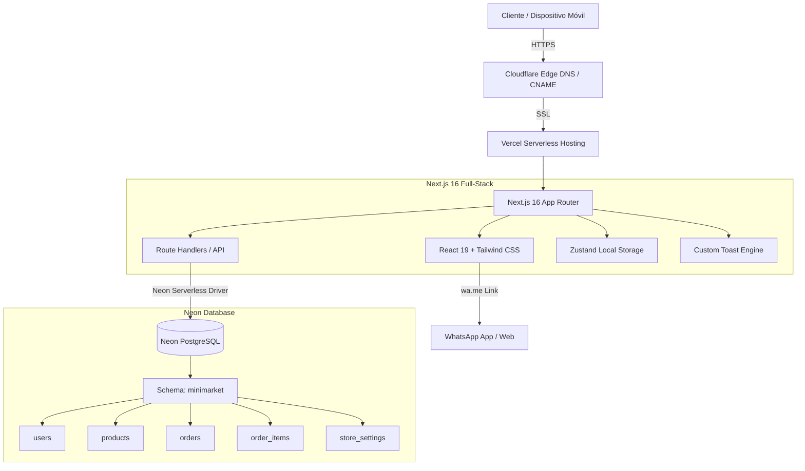

# 🥬 Kaibutsu Market - Documentación Integral del Proyecto

> **Versión del Sistema:** 1.0.0 (MVP Producción)  
> **Framework:** Next.js 16 (App Router + Turbopack)  
> **Base de Datos:** PostgreSQL en Neon (Serverless, esquema aislado `minimarket`)  
> **Dominio en Producción:** [https://market.kaibutsu.cl](https://market.kaibutsu.cl)  
> **Repositorio GitHub:** [KaibutsuDev/kaibutsu-market](https://github.com/KaibutsuDev/kaibutsu-market)  
> **Fecha de Documentación:** Septiembre 2026  

---

## 1. Resumen Ejecutivo y Alcance

**Kaibutsu Market** es una plataforma web moderna de comercio local (comercio de proximidad) diseñada para almacenes, verdulerías y minimarkets familiares. Su objetivo es digitalizar la recepción de pedidos sin los costos ni la fricción asociados a comisiones por pasarelas de pago (Transbank, Mercado Pago, etc.), aprovechando **WhatsApp** como canal directo de confirmación y fidelización.

### Principales Problemas que Resuelve:
1. **Cero costos de pasarela y comisiones:** No retiene dinero de los comerciantes ni cobra porcentajes por transacción.
2. **Cero costos de mensajería (WhatsApp $0):** Utiliza enlaces dinámicos bajo el protocolo universal `wa.me` en lugar de costosas APIs empresariales de Meta.
3. **Control estricto de Stock e Inventario:** Descuento instantáneo de existencias al crear pedidos y reposición automática si una orden se cancela.
4. **Diseñado para Smartphones:** Interfaz Mobile-First optimizada para clientes que compran desde el celular y comerciantes que administran desde el mostrador.

---

## 2. Arquitectura Tecnológica y Stack



### Componentes Clave:
* **Framework:** Next.js 16.3.6 (App Router, Turbopack, React 19).
* **Estilos:** Tailwind CSS v4 con variables CSS forzadas en modo claro de alto contraste (WCAG compatible).
* **Gestión de Estado del Carrito:** Zustand con persistencia automática en `localStorage`.
* **Seguridad y Autenticación:** JWT (`jsonwebtoken`) cifrado en cookies `httpOnly`, con passwords hasheadas mediante `bcryptjs`.
* **Base de Datos:** Neon PostgreSQL Serverless utilizando esquema dedicado `minimarket` para convivencia limpia con otras bases de datos compartidas.
* **Infraestructura Cloud:** Repositorio en GitHub (`KaibutsuDev`), hosting en Vercel y enrutamiento CNAME con SSL automático en Cloudflare DNS.

---

## 3. Modelo de Datos (Neon PostgreSQL - Schema `minimarket`)

### 1. `minimarket.users`
Almacena usuarios registrados (clientes y administradores).
| Columna | Tipo | Descripción |
| :--- | :--- | :--- |
| `id` | UUID | Llave primaria (generada por `gen_random_uuid()`) |
| `email` | VARCHAR(255) | Correo único para login |
| `password_hash` | TEXT | Hash seguro generado con Bcrypt |
| `full_name` | VARCHAR(255) | Nombre y apellido del cliente |
| `phone` | VARCHAR(50) | Celular / WhatsApp de contacto |
| `default_address`| TEXT | Dirección habitual prellenada |
| `role` | VARCHAR(50) | Rol del usuario (`customer`, `admin`, `superadmin`) |
| `created_at` | TIMESTAMP | Fecha de registro |

### 2. `minimarket.products`
Catálogo de productos e inventario disponible.
| Columna | Tipo | Descripción |
| :--- | :--- | :--- |
| `id` | UUID | Llave primaria |
| `name` | VARCHAR(255) | Nombre del producto |
| `description` | TEXT | Descripción y detalles |
| `price` | INTEGER | Precio en CLP |
| `stock` | INTEGER | Existencias físicas disponibles |
| `is_available` | BOOLEAN | Switch manual de disponibilidad (true = disponible, false = forzar agotado) |
| `category` | VARCHAR(100) | Agrupación (Frutas, Verduras, etc.) |
| `image_url` | TEXT | Fotografía del producto |
| `updated_at` | TIMESTAMP | Última modificación de datos o stock |

### 3. `minimarket.orders`
Registro de órdenes de compra realizadas.
| Columna | Tipo | Descripción |
| :--- | :--- | :--- |
| `id` | UUID | Llave primaria |
| `order_number` | SERIAL | Número correlativo visible (ej. `#1001`) |
| `customer_id` | UUID (FK) | Vínculo a `minimarket.users` |
| `customer_name`| VARCHAR(255) | Nombre histórico del cliente |
| `customer_phone`| VARCHAR(50) | Teléfono de WhatsApp del cliente |
| `delivery_type`| VARCHAR(50) | `pickup` (Retiro) o `delivery` (Envío) |
| `delivery_address`| TEXT | Dirección puntual indicada para esta entrega |
| `delivery_notes`| TEXT | Indicaciones especiales del cliente |
| `total_amount` | INTEGER | Total a pagar en CLP |
| `status` | VARCHAR(50) | Estado: `pending`, `confirmed`, `delivered`, `cancelled` |
| `created_at` | TIMESTAMP | Fecha y hora del pedido |

### 4. `minimarket.order_items`
Líneas de detalle con copia histórica de precios por orden.
| Columna | Tipo | Descripción |
| :--- | :--- | :--- |
| `id` | UUID | Llave primaria |
| `order_id` | UUID (FK) | Relación a `minimarket.orders` |
| `product_id` | UUID (FK) | Relación al producto base |
| `product_name` | VARCHAR(255) | Nombre histórico del producto |
| `unit_price` | INTEGER | Precio al momento de comprar |
| `quantity` | INTEGER | Cantidad solicitada |
| `subtotal` | INTEGER | `unit_price * quantity` |

### 5. `minimarket.store_settings`
Configuraciones dinámicas de la tienda editables por el vendedor.
| Columna | Tipo | Descripción |
| :--- | :--- | :--- |
| `id` | VARCHAR(50) | Identificador único (`'current'`) |
| `is_open` | BOOLEAN | Estado comercial (`true` = Atendiendo, `false` = Cerrado) |
| `store_phone` | VARCHAR(50) | Número telefónico de WhatsApp de la tienda para recibir pedidos |
| `schedule_text` | VARCHAR(255) | Horario visible (ej. *Lunes a Sábado: 09:00 - 21:00 hrs*) |
| `announcement_text`| TEXT | Mensaje o aviso especial opcional |
| `updated_at` | TIMESTAMP | Última actualización |

---

## 4. Funcionalidades Detalladas del Sistema

### 🛒 A. Módulo del Cliente (Frontend Tienda)

1. **Cartel de Horario & Estado en Vivo:**
   * Ubicado sobre los productos en la portada.
   * Renderiza el estado comercial con un indicador LED interactivo:
     * **● Atendiendo Ahora:** Badge verde con animación de radar `animate-ping`.
     * **Cerrado por ahora:** Badge rojo cuando el local suspende atención momentáneamente.
   * Muestra el horario configurado y avisos de temporada.
2. **Catálogo Interactivo con Búsqueda y Filtros:**
   * Búsqueda en tiempo real por nombre o descripción.
   * Filtros por píldoras de categorías dinámicas (*Todos*, *Frutas*, *Verduras*, etc.).
   * Badges de stock visuales: *"Agotado"*, *"¡Últimas X un.!"*, *"Stock: X"*.
3. **Tarjeta de Producto Inteligente (Mobile First):**
   * Botón compacto optimizado para pantallas pequeñas que previene colisiones con el precio.
   * Animación reactiva instantánea (*"¡Listo!"* con check).
   * Límite estricto: Bloquea la adición si se alcanza la existencia real del producto.
4. **Sistema de Notificaciones Toast Sobrepuestas:**
   * Los avisos de confirmación se sobreponen en un único slot en la parte superior sin apilarse ni tapar el catálogo.
5. **Carrito de Compras y Modalidad de Entrega:**
   * Selector interactivo entre **Retiro en Local** o **Envío a Domicilio**.
   * Campo de dirección específica para el despacho y notas del pedido (ej. timbre, cambio de billete).
   * Controles de cantidad (+ / -) con validación de stock máximo.
6. **Confirmación en Dos Pasos y Despacho WhatsApp:**
   * Al pulsar *"Confirmar Pedido"*, el backend descuenta el stock de inmediato.
   * Despliega la pantalla de éxito con el botón **"Enviar Pedido a la Tienda por WhatsApp"**, abriendo la aplicación con el mensaje estructurado prellenado hacia el número configurado de la tienda.
7. **Historial "Mis Pedidos":**
   * Panel privado donde el cliente consulta el historial de sus compras, el detalle de productos, su total y el estado en que se encuentra su orden (*Pendiente*, *Confirmado*, *Entregado*, *Cancelado*), con botón para reenviar el pedido si fuera necesario.

---

## 5. Módulo del Vendedor / Administrador (`/admin`)

Acceso protegido mediante autenticación de vendedor:
* **Credenciales:** `admin@minimarket.cl` / `admin1234`

El panel centraliza tres vistas estratégicas:

### 1. Gestión de Pedidos Recibidos
* **Filtros por Estado:** Visualización rápida de órdenes *Pendientes*, *Confirmadas*, *Entregadas* o *Canceladas*.
* **Botón de Contacto por WhatsApp con Detalle de Productos:**
  * Abre una conversación directa con el celular del cliente.
  * **Genera automáticamente el listado completo de productos:**
    ```text
    👋 ¡Hola Juan Pérez! Te contactamos de Kaibutsu Market referente a tu Pedido #1005:

    📦 Modalidad: 🛵 Envío a Domicilio (📍 Av. Siempreviva 742)

    📋 Detalle de tu pedido:
    • 2x Tomate Larga Vida (1 Kg) ($3.780)
    • 1x Lechuga Costina Fresca ($1.200)
    • 1x Papas Granel (2 Kg) ($2.490)

    💰 Total a pagar: $7.470

    Te escribimos para coordinar los detalles y confirmarte la disponibilidad. ¿Nos confirmas si todo está correcto para prepararlo?
    ```
* **Acciones de Estado de Pedido:**
  * *Marcar Confirmado* (pasa a preparación).
  * *Marcar Entregado* (concluye la venta).
  * *Cancelar Pedido:* **Devuelve automáticamente el stock de todos los productos al inventario.**

### 2. Gestión de Inventario y Catálogo
* **Actualización Rápida de Stock:** Input numérico directo en la tabla para modificar existencias sin abrir ventanas modales.
* **Interruptor Disponible / Agotado:** Botón rápido para pausar o activar la venta de un producto en un clic.
* **Modal CRUD:** Crear nuevos productos o editar nombre, descripción, precio, categoría, stock y fotografía.
* **Eliminación Segura:** Opción de borrar productos con confirmación de seguridad.

### 3. Horarios & Configuración de Tienda
* **Control de Apertura / Cierre:** Switch para cambiar la tienda entre *Atendiendo* y *Cerrado*.
* **WhatsApp de la Tienda Dinámico:** Permite ingresar o cambiar en cualquier momento el número de WhatsApp receptor de pedidos (`store_phone`) sin necesidad de tocar variables de entorno ni reiniciar servidores.
* **Edición de Horario Comercial:** Texto libre para definir días y rangos de atención.
* **Mensaje de Anuncio:** Campo para promociones o avisos de entrega.
* **Vista previa en tiempo real** del cartel antes de guardar.

---

## 6. Matriz de Endpoints de la API

| Método | Endpoint | Acceso | Descripción |
| :--- | :--- | :--- | :--- |
| `POST` | `/api/auth/register` | Público | Registra un nuevo cliente y setea cookie JWT |
| `POST` | `/api/auth/login` | Público | Inicia sesión de cliente o vendedor |
| `GET` | `/api/auth/me` | Autenticado | Obtiene los datos del usuario en sesión |
| `POST` | `/api/auth/me` | Autenticado | Cierra sesión y limpia cookies |
| `GET` | `/api/products` | Público | Lista productos con filtros de búsqueda, categoría y disponibilidad |
| `POST` | `/api/products` | Admin | Crea un nuevo producto en catálogo |
| `PUT` | `/api/products/[id]` | Admin | Actualiza datos, stock o disponibilidad de un producto |
| `DELETE` | `/api/products/[id]` | Admin | Elimina un producto del catálogo |
| `GET` | `/api/orders` | Autenticado | Lista pedidos del usuario (o todos los pedidos si es admin) |
| `POST` | `/api/orders` | Autenticado | Crea orden, descuenta stock y valida existencias |
| `PATCH`| `/api/orders/[id]` | Admin | Actualiza estado de pedido (reintegra stock si se cancela) |
| `GET` | `/api/settings` | Público | Obtiene horarios, estado abierto/cerrado y WhatsApp de la tienda |
| `PUT` | `/api/settings` | Admin | Actualiza horarios, estado abierto/cerrado y WhatsApp de la tienda |

---

## 7. Procedimientos de Mantenimiento y Despliegue

### Despliegue Continuo (CI/CD)
El proyecto está enlazado a GitHub y Vercel. Cada cambio enviado al branch `main` dispara automáticamente la compilación en Turbopack y el despliegue a producción:

```bash
git add .
git commit -m "feat/fix: descripcion de la mejora"
git push origin main
```

### Respaldos Locales
Se mantiene una réplica limpia de la estructura del código base en:  
📁 `d:\GitHub\minimarket-webapp-backup`
